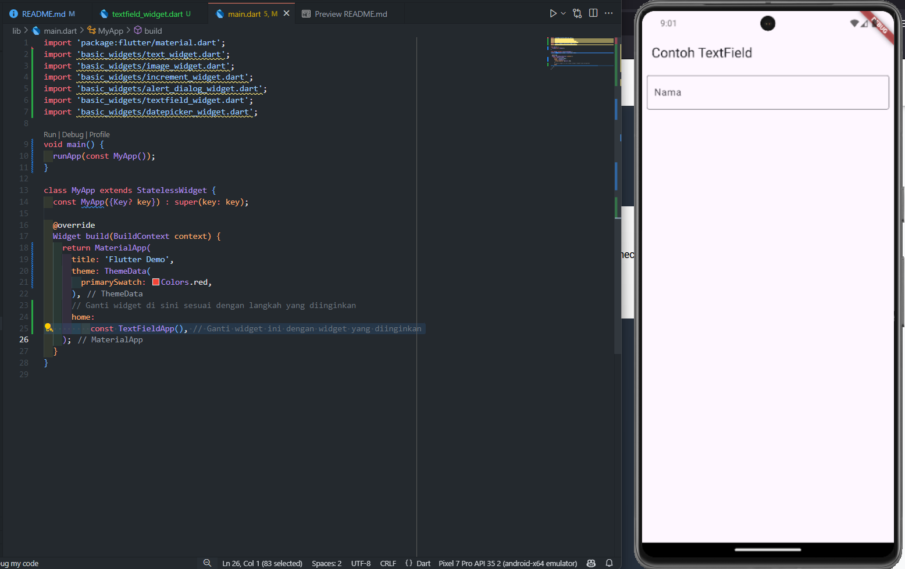

# hello_world

A New Flutter Project for Mobile Programming Week 5.


---

### Tugas Praktikum

1. Selesaikan Praktikum 1 sampai 5, lalu dokumentasikan dan push ke repository Anda berupa screenshot setiap hasil pekerjaan beserta penjelasannya di file README.md!

    Jawab:

    * Praktikum 1 - Membuat Project Flutter Baru

        Gambar di bawah merupakan cara kita membuat Project Baru di Flutter dengan menekan tombol Ctrl + Shift + P maka akan tampil Command Palette dan ketik flutter untuk merincikan dan pilih "Flutter: New Project".

        
        <br></br>

        Setelah melakukan langkah pembuatan projek baru di flutter, maka anda akan diarahkan menuju file explorer untuk memilih lokasi penyimpanan dimana projek flutter tersebut akan disimpan dengan menekan tombol "Select a folder to create the project in". 
        <br></br>

        

        Setelah memilih direktori penyimpanan projek, maka pengguna akan diberi textfield untuk memberikan nama projek flutter ini. Pada praktikum ini nama projek yang digunakan adalah "hello_world". Lalu tunggu sampai projek flutter selesai dibuat seperti gambar di bawah ini

        

        

    <br></br>

    * Praktikum 2 - Menghubungkan Perangkat Android atau Emulator

        Untuk bisa menghubungkan perangkat android ke menggunakan USB atau Wireless untuk debug. Maka klik tujuh kali build number pada tentang ponsel anda.
    
        
    <br></br>

        Setelah itu user diharap menuju ke pengaturan pilihan pengembang dan aktifkan proses debug menggunakan USB. 

        
    <br></br>

        Setelah itu akan muncul pesan peringatan mengenai izin untuk debugging menggunakan USB. Pengguna harus mengizinkan untuk bisa lanjut ke proses berikutnya.

        
    <br></br>

        Jika pada smartphone pengguna sudah diizinkan, jangan lupa untuk download Google USB Driver pada Android Studio pada bagian SDK Tools

        
    <br></br>

        Maka dapat dilihat bahwa smartphone telah terhubung menggunakan kabel USB

        
    <br></br>

    
        Untuk bisa melakukan debug menggunakan perangkat android via wireless, maka pada pilihan pengembang aktifkan proses debug nirkabel.

        
    <br></br>

        Lalu buka android studio dan buka projek anda. Lalu pada bagian device pilih Pair Devices Using Wi-Fi.

        
    <br></br>

        Maka akan muncul QR code yang pengguna perlu men-scan untuk bisa menghubungkan laptop user dan smatphone mereka. 

        

        Jika Anda ingin menyambungkan perangkat dengan kode penghubung, pilih Pair device with pairing code, lalu masukkan 6 digit kode.
    <br></br>

    * Praktikum 3 - Membuat Repository GitHub dan Laporan Praktikum

        Pertama-tama pengguna harus login ke akun github, lalu buat repositori baru dengan nama "flutter-fundamental-part1". Lalu klik tombol "Create Repository"

        
    <br></br>

        Setelah klik tombol "Create Repository" maka akan tampil repositori github yang kita buat seperti gambar di bawah ini

        
    <br></br>

        Kembali ke VS Code pada projek hello_world, lalu buka terminal dan ketik perintah git init untuk inisialisasi git pada project tersebut.

        
    <br></br>

        Pilih menu Source Control di bagian kiri, lalu lakukan stages (+) pada file .gitignore untuk mengunggah file pertama ke repository GitHub. Tulis juga pesan commit sesuai dengan kondisinya dan klik commit

        
    <br></br>

        Lakukan push dengan klik bagian menu titik tiga > Push

        
    <br></br>

        Setelah itu akan muncul pesan peringtan di pojok kanan bawah, yang mengarahkan kita untuk remote untuk konfigurasi. Jika kita klik "Add Remote" maka akan muncul textfield yang kemudian akan kita isi dengan link repository flutter-fundamental-part1 yang telah kita buat tadi.

        
    <br></br>

        Setelah berhasil, tulis remote name dengan "origin"

        
    <br></br>

        Lalu lakukan stages (+) pada file yang lainnya dan lakukan commit pada repository yang telah kita buat tadi. Yang kemudian repository github kita akan menjadi seperti ini.

        
    <br></br>

    * Praktikum 4 - Menerapkan Widget Dasar

        Buat folder baru basic_widgets di dalam folder lib. Kemudian buat file baru di dalam basic_widgets dengan nama text_widget.dart. Dan isi kode program seperti gambar di bawah ini:

        
    <br></br>
    <br></br>

        Setelah itu file text_widget.dart ke main dart dengan menempatkan const MyTextWidget()  di dalam properti children dari Column, yang berada di dalam body dari Scaffold. Lokasinya adalah di bagian utama layar aplikasi (pusat halaman) dan disusun secara vertikal, karena mainAxisAlignment disetel ke MainAxisAlignment.center. Ini berarti  widget akan muncul di tengah layar. 

        
    <br></br>
    <br></br>

        Buat sebuah file image_widget.dart di dalam folder basic_widgets dengan kode program seperti gambar berikut

        
    <br></br>
    <br></br>

        Lalu buat folder assets yang akan kita gunakan untuk menyimpan gambar logo Polinema, kemudian dilakuakn penyesuaian asset pada file pubspec.yaml seperti gambar di bawah:

        

        
    <br></br>
    <br></br>

        Setelah itu file image_widget.dart ke main dart dengan menempatkan const MyImageWidget()  di dalam properti children dari Column, yang berada di dalam body dari Scaffold. Lokasinya adalah di bagian utama layar aplikasi (pusat halaman) dan disusun secara vertikal, karena mainAxisAlignment disetel ke MainAxisAlignment.center. Ini berarti kedua  widget akan muncul di tengah layar.

         
    <br></br>

    * Praktikum 5 - Menerapkan Widget Material Design dan iOS Cupertino

        ```dart
        import 'package:flutter/cupertino.dart';
        import 'package:flutter/material.dart';

        class MyWidget extends StatelessWidget {
        const MyWidget({super.key});

        @override
        Widget build(BuildContext context) {
            return MaterialApp(
            home: Container(
                margin: const EdgeInsets.only(top: 30),
                color: Colors.white,
                child: Column(
                children: <Widget>[
                    CupertinoButton(
                    child: const Text("Contoh button"),
                    onPressed: () {},
                    ),
                    const CupertinoActivityIndicator(),
                ],
                ),
            ),
            );
        }
        }
        ```

        Kode di atas berfungsi untuk membuat aplikasi sederhana menggunakan MaterialApp yang menampilkan sebuah CupertinoButton dan CupertinoActivityIndicator. Kode ini memanfaatkan framework Material dan Cupertino untuk membangun antarmuka dengan gaya khas iOS. Dalam Widget build, terdapat MaterialApp sebagai root aplikasi, yang di dalamnya terdapat Container dengan margin di bagian atas. Container tersebut memiliki dua elemen utama: CupertinoButton yang berfungsi untuk menampilkan teks "Contoh button", namun tidak memiliki aksi apapun karena method onPressed masih kosong, dan CupertinoActivityIndicator yang berfungsi menampilkan animasi loading berputar. Animasi ini sering digunakan untuk memberi tahu pengguna bahwa aplikasi sedang memproses sesuatu. Kombinasi elemen-elemen ini menciptakan tampilan antarmuka yang ringan dan sederhana dengan gaya iOS di dalam aplikasi berbasis Flutter.
        <br></br>
        
        ```dart
        import 'package:flutter/material.dart';

        class MyWidget extends StatelessWidget {
        const MyWidget({super.key});

        @override
        Widget build(BuildContext context) {
            return MaterialApp(
            home: Scaffold(
                floatingActionButton: FloatingActionButton(
                onPressed: () {
                    // Add your onPressed code here!
                },
                child: const Icon(Icons.thumb_up),
                backgroundColor: Colors.pink,
                ),
            ),
            );
        }
        }
        ```

        Kode di atas digunakan untuk membuat sebuah aplikasi berbasis Flutter dengan tampilan sederhana menggunakan MaterialApp dan Scaffold. Di dalam Scaffold, terdapat FloatingActionButton, yaitu tombol aksi melayang berbentuk bulat yang umumnya digunakan untuk aksi utama di aplikasi. Tombol ini menampilkan ikon thumb_up (jempol ke atas) dengan latar belakang berwarna pink. Fungsinya adalah untuk menjalankan aksi tertentu ketika ditekan, namun pada contoh ini, bagian onPressed masih kosong sehingga belum ada aksi yang dijalankan. Secara keseluruhan, kode ini membentuk sebuah aplikasi dasar dengan tombol aksi melayang untuk mengeksekusi fungsi tertentu saat ditekan, yang lazim digunakan dalam berbagai aplikasi untuk meningkatkan interaksi pengguna.
        <br></br>

        ---
        * Scaffold Widget

             

            Kode di atas adalah aplikasi Flutter sederhana yang berfungsi sebagai penghitung. Aplikasi ini terdiri dari widget MyApp, yang menggunakan MaterialApp dengan tema berwarna merah, dan MyHomePage, yang merupakan halaman utama. Di dalam MyHomePage, terdapat variabel _counter untuk menyimpan jumlah penekanan tombol, yang ditingkatkan oleh fungsi _incrementCounter saat tombol floating action button ditekan.

            Scaffold digunakan untuk mengatur tata letak, dengan AppBar menampilkan judul, area pusat menampilkan teks penghitung, dan BottomAppBar memberikan ruang di bawah. FloatingActionButton dengan ikon "+" berfungsi untuk menambah nilai penghitung dan diletakkan di tengah bagian bawah layar.
        <br></br>

        * Dialog Widget

            
        <br></br>
            Setelah menekan tombol Show Alert

            

            Kode di atas adalah aplikasi Flutter sederhana yang menampilkan dialog peringatan saat tombol ditekan. MyApp berfungsi sebagai aplikasi utama dengan MaterialApp dan Scaffold. Di dalam MyLayout, terdapat ElevatedButton bertuliskan "Show alert". Ketika tombol ini ditekan, fungsi showAlertDialog dipanggil untuk menampilkan dialog dengan judul "My title" dan pesan "This is my message". Dialog ini juga memiliki tombol "OK" untuk menutupnya. Secara keseluruhan, kode ini menciptakan antarmuka yang merespons interaksi pengguna dengan menampilkan dialog peringatan.
        <br></br>

        * Input dan Selection Widget

            
        <br></br>

            Setelah Mengisi textfield

            
        
            Kode di atas adalah aplikasi Flutter yang menampilkan TextField untuk input teks pengguna. MyApp berfungsi sebagai widget utama dengan menggunakan MaterialApp dan Scaffold. Di dalam Scaffold, terdapat AppBar dengan judul "Contoh TextField" dan body yang berisi TextField. Properti obscureText pada TextField diatur ke false, yang berarti teks yang dimasukkan tidak akan disembunyikan. Decorasi InputDecoration digunakan untuk memberikan garis batas dengan OutlineInputBorder dan label bertuliskan "Nama". Secara keseluruhan, kode ini menciptakan antarmuka sederhana untuk mengumpulkan input nama dari pengguna.
        <br></br>

        * Date and Time Pickers

            
        <br></br>
            Setelah menekan tombol Pilih Tanggal

            
        <br></br>
            Setelah memilih salah satu tanggal

            

            Kode di atas adalah aplikasi Flutter yang memungkinkan pengguna memilih tanggal menggunakan DatePicker. Widget utama, MyApp, menjalankan MaterialApp dengan judul "Contoh Date Picker", sementara MyHomePage berfungsi sebagai halaman utama yang menyimpan tanggal yang dipilih dalam variabel selectedDate. Fungsi _selectDate menampilkan dialog showDatePicker dengan tanggal awal yang diatur ke tanggal saat ini dan batas tanggal yang dapat dipilih. Jika pengguna memilih tanggal baru, fungsi ini memanggil setState untuk memperbarui selectedDate. Dalam metode build, terdapat Scaffold yang menampilkan judul di AppBar dan dua elemen di body: teks yang menampilkan tanggal yang dipilih dan tombol ElevatedButton untuk membuka dialog pemilih tanggal. Saat tombol ditekan, fungsi _selectDate dipanggil, dan mencetak hari, bulan, dan tahun dari tanggal yang dipilih. Secara keseluruhan, kode ini menciptakan antarmuka sederhana untuk memilih dan menampilkan tanggal.
<br></br>

---

2. Selesaikan Praktikum 2 dan Anda wajib menjalankan aplikasi hello_world pada perangkat fisik (device Android/iOS) agar Anda mempunyai pengalaman untuk menghubungkan ke perangkat fisik. Capture hasil aplikasi di perangkat, lalu buatlah laporan praktikum pada file README.md.

    Jawab:
    Perangkat yang saya gunakan adalah Samsung A73, berikut hasilnya:

    
<br></br>

---
3. Pada praktikum 5 mulai dari Langkah 3 sampai 6, buatlah file widget tersendiri di folder basic_widgets, kemudian pada file main.dart cukup melakukan import widget sesuai masing-masing langkah tersebut!

    Jawab:

    * Widget Langkah 3 - Scaffold Widget

        File increment_widget.dart

        

        <br></br>

        Memanggil widget pada main.dart dan outputnya

        

        <br></br>

    * Widget Langkah 4 - Dialog Widget

        File alert_dialog_widget.dart

        

        <br></br>

        Memanggil widget pada main.dart dan outputnya

        

        

        <br></br>

    * Widget Langkah 5 - Input dan Selection Widget

        File textfield_widget.dart

        

        <br></br>

        Memanggil widget pada main.dart dan outputnya

        

        

        <br></br>

    * Widget Langkah 6 - Date and Time Pickers

        File datepicker_widget.dart

        

        <br></br>

        Memanggil widget pada main.dart dan outputnya

        

        

        <br></br>


<br></br>


